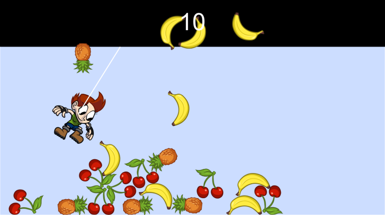

# Phaser P2 Physics Example

This repository contains the source code for the [Phaser and P2 Physics Tutorial](https://www.codeandweb.com/blog/2015/10/07/phaser-p2-physics-example-tutorial)

You'll learn

* Basic setup of the project
* Creating collision shapes using PhysicsEditor
* Adding physics enabled sprites
* Adding springs
* Reacting to collisions
* 